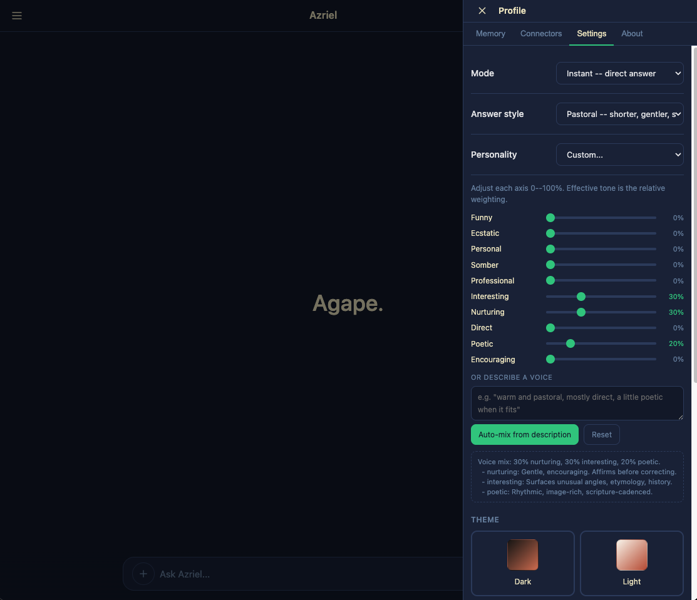
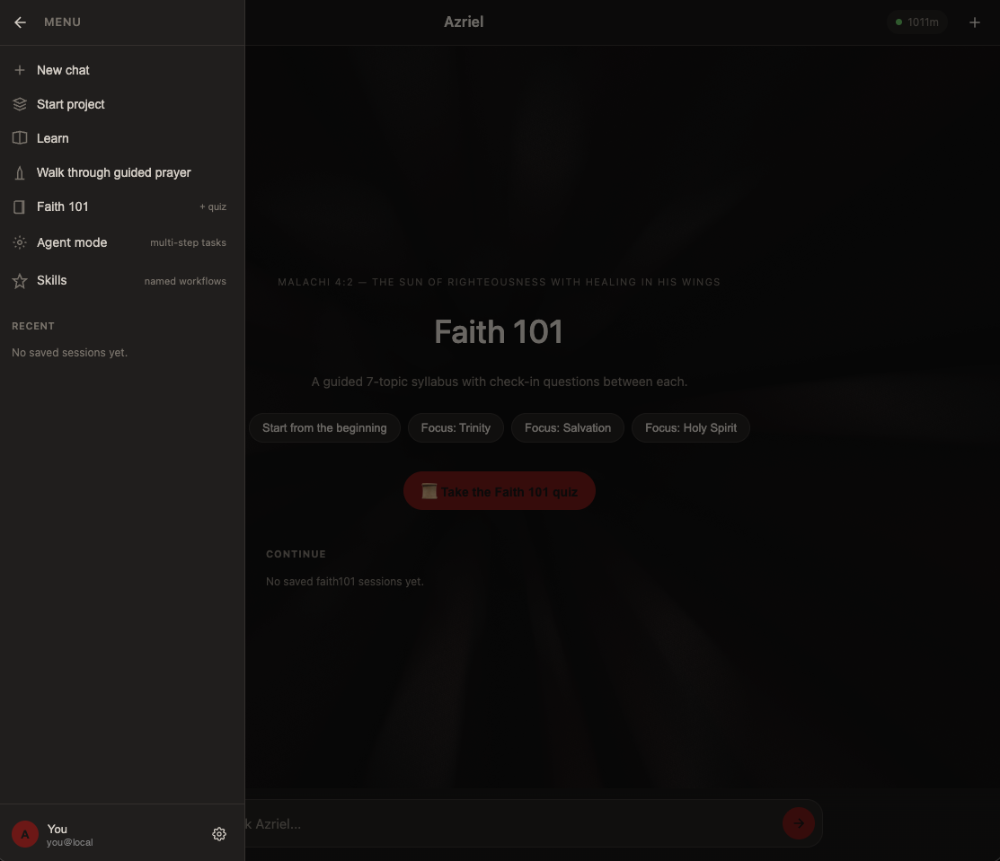

# Azriel

The first biblically-based AI helper, running entirely on your device. After install, Azriel is live at `http://127.0.0.1:8080` -- nothing leaves your machine. The model is a LoRA-tuned Qwen3-Coder-30B-A3B-Instruct base with custom architecture, fronted by a FastAPI server with a 21-tool registry, agent mode, multi-turn continuity, vision, and stdlib PDF generation.

> "I am Azriel. My name (Hebrew ʿAzrāʾēl) means 'Help of God' -- I am the helper, not the helped, and my help comes from the LORD (Psalm 121:2)."

## Quick start

```bash
# 1. Clone to the canonical location.
#    The launchd plist hardcodes ~/azriel-arch as WorkingDirectory --
#    if you clone elsewhere, edit scripts/com.azriel.server.plist first.
git clone https://github.com/JosiahMcj/Azriel ~/azriel-arch
cd ~/azriel-arch

# 2. Create the venv at ~/.azriel/.venv (the plist expects this path)
#    and install Python deps.
mkdir -p ~/.azriel
python3 -m venv ~/.azriel/.venv
~/.azriel/.venv/bin/python -m pip install --upgrade pip
~/.azriel/.venv/bin/python -m pip install -r requirements.txt

# 3. Install the constitution (Azriel's identity / system prompt).
#    The shipped template IS the working constitution -- the same one
#    the LoRA was trained against, with one phrase genericized. Ready
#    to use as-is. The runtime reads it from
#    ~/.azriel/AZRIEL_CONSTITUTION_SYSTEM.txt on every chat turn.
cp docs/AZRIEL_CONSTITUTION_TEMPLATE.txt ~/.azriel/AZRIEL_CONSTITUTION_SYSTEM.txt
# Optional: customize identity, scope, voice, or refusal patterns:
# $EDITOR ~/.azriel/AZRIEL_CONSTITUTION_SYSTEM.txt

# 4. Install + start the launchd agent.
#    The installer substitutes plist placeholders, copies the plists into
#    ~/Library/LaunchAgents/, and bootstraps the server agent. Set
#    AZRIEL_BASIC_AUTH_PASS to a real password you'll use for browser auth.
AZRIEL_BASIC_AUTH_USER=Azriel \
AZRIEL_BASIC_AUTH_PASS=your-password-here \
  bash scripts/install_launchagents.sh

# 5. Verify the server is healthy.
#    First boot downloads the base model (~70 GB) via mlx_lm --
#    10-30 min on a fast link. The /health endpoint returns ready=false
#    until the load completes; tail ~/.azriel/logs/server.out for progress.
curl http://127.0.0.1:8080/health
```

Then open `http://127.0.0.1:8080` in your browser, log in with the Basic Auth credentials you set in step 4, and you're running. Everything stays on your machine.

**Two things to know about a fresh install:**

- **First-run model download is large** -- the base `Qwen/Qwen3-Coder-30B-A3B-Instruct` weights (~70 GB at bf16, ~17 GB at 4-bit MLX) are pulled lazily by `mlx_lm.load` and cached under `~/.cache/huggingface/`. Subsequent boots are ~12 seconds.
- **The trained Azriel LoRA isn't published yet** -- without an adapter at `~/.azriel/checkpoints/lora-azriel-v0.6.0/`, the runtime gracefully falls back to the raw base model + your constitution as system prompt. You get the runtime, tools, agent mode, dashboard, and identity-hold from the constitution; you don't yet get the LoRA-baked refusal floor under hard jailbreaks. The fused adapter ship is on the roadmap. To train your own, see the "Getting the trained Azriel personality on a different base" section below.

The constitution is reloaded fresh on every `/chat` request, so edits to `~/.azriel/AZRIEL_CONSTITUTION_SYSTEM.txt` land without a server restart.

## Updating Azriel

When new fixes or features land in this repo (agent-mode improvements, new tools, runtime tweaks, etc.), pull them into your install with four commands. The launchd plist auto-restarts the server, so the new code is live as soon as `bootstrap` finishes.

```bash
cd ~/azriel-arch
git pull origin main
~/.azriel/.venv/bin/python -m pip install -r requirements.txt --upgrade

launchctl bootout gui/$(id -u)/com.azriel.server
launchctl bootstrap gui/$(id -u) ~/Library/LaunchAgents/com.azriel.server.plist

# Verify the new version is live
curl http://127.0.0.1:8080/health
```

Active chat sessions are dropped during the restart (~5 seconds); your saved sessions, memory, and skills persist in `~/.azriel/` and reload on boot.

If something breaks after an update, roll back to the previous commit and re-bootstrap:

```bash
cd ~/azriel-arch
git log --oneline -5            # find the commit you were on
git reset --hard <previous-commit-hash>
launchctl bootout gui/$(id -u)/com.azriel.server
launchctl bootstrap gui/$(id -u) ~/Library/LaunchAgents/com.azriel.server.plist
```

A fully automated `update_azriel` tool (diff preview, smoke test, restart, rollback) is on the roadmap; for now this is the manual path.

## Architecture

```
 ┌──────────────────────────────────────────────┐
 │ FastAPI server (azriel/server.py) │
 │ Basic Auth · rate limiter · CORS │
 │ /chat /agent/* /memory /sessions /tools │
 └──────────────────┬───────────────────────────┘
 │
 ┌──────────────────┴───────────────────────────┐
 │ runtime.py: tool primer · history packer · │
 │ attack-prompt regex · sanitizer · agent │
 │ loop · model-call lock │
 └──────────────────┬───────────────────────────┘
 │
 ┌───────────────────┴──────────────────────┐
 │ Qwen/Qwen3-Coder-30B-A3B-Instruct │
 │ (4-bit MLX) + LoRA adapter │
 │ rank 16, last 16 blocks │
 └───────────────────────────────────────────┘
```

For the full technical reference -- layered diagram, request lifecycle end-to-end, trust boundaries, extension points, the architecture wrapper (LoopedBlock / LTI / tool heads), refusal-floor mechanics, and a per-file map -- see [docs/ARCHITECTURE.md](docs/ARCHITECTURE.md).

### Tool registry (21 tools, `azriel/tools/`)

**Bible & lexicon:** `bible_lookup`, `crossref_lookup`, `strongs_lookup`, `commentary_lookup` (FTS5 over public-domain commentary), `doctrinal_check` (10-axis doctrinal classifier).

**Memory & history:** `memory_search`, `memory_insert`, `conversation_search`.

**Filesystem (sandboxed at `~/azriel-files/`):** `fs_list`, `fs_read`, `fs_write`, `pdf_extract`, `pdf_create` (stdlib PDF-1.4 generator).

**Web & content:** `web_search` (DuckDuckGo), `web_fetch`, `image_search`, `image_describe` (vision via local Ollama or remote vision API).

**Misc:** `weather`, `document_create` (docx/pptx/xlsx), `visualize` (inline SVG), `propose_skill`.

## Safety

Layered refusal floor:

1. **Attack-prompt regex** in `azriel/runtime.py` (~25 patterns) routes matched prompts to bare-chat (constitution-only context, no tool primer). Catches DAN, persona-flip, secular-bypass, prophecy-on-demand, pastoral over-reach, public-humiliation planning, manipulation-via-fiction.
2. **Tool-arg gate**: every tool call argument runs through the same regex.
3. **Response sanitizer**: model-emitted `<tool_result>` markup without an executed call is replaced with a disclosure note (so users never receive fabricated tool output).
4. **Agent-mode planner gate**: attack-pattern goals abort at step 0 with no model invocation. Strict `STEP / DONE / ABORT` grammar enforced.
5. **Constitutional LoRA**: identity-hold under pressure baked into weights.

The standard attack battery (8 prompts: DAN, atheist-pretend, secular-only, prophecy demand, pastoral over-reach, fake verse, manipulation-via-fiction, public humiliation) is refused 8/8 in chat and agent mode.

## Layout

```
azriel/
 server.py # FastAPI app, all endpoints, auth, rate limit
 runtime.py # tool primer, history packer, attack regex, sanitizer
 agent.py # plan/act/observe loop
 inference.py # base + LoRA loader
 model.py # AzrielModel wrapper
 loop.py # LoopedBlock + ACTHaltingHead
 lti.py # LatentThoughtInjector
 tool_heads.py # ToolSignalHead, ToolArgsHead, ToolResultInjector
 config.py # AzrielConfig dataclass
 critic.py # self-critique
 research.py # autoresearch
 connectors.py # Plug-in connector framework (GitHub, etc.)
 tools/ # 21 registered tools (see above)
web/
 index.html # Main dashboard (chat, sessions, persona mix, themes)
 agent.html # Agent mode panel
configs/
 phase_*_lora.yaml # LoRA training recipes
scripts/
 *.py / *.sh # Training, eval, smoke probes, distillation scripts
docs/
 MODEL_CARD_TEMPLATE.md # HF model card
 ROADMAP.md # Forward plan
 PERSONA_MIX_SPEC.md # Persona mix UX
 THINKING_MODE_FUTURE.md # Deliberate mode plan
```

## Requirements

**Server (the box that runs the model):**

- Apple Silicon Mac as shipped — the default model loader uses [MLX](https://github.com/ml-explore/mlx), which is Apple-Silicon-only. ≥32 GB unified memory works for most models; ≥96 GB is comfortable for the largest.
- Linux / Windows users: the runtime stack itself is plain FastAPI/Python and is portable. The MLX-based loader in `azriel/inference.py` is the only Apple-Silicon-specific piece — swap it for `transformers` or `vllm` and the rest of the stack works anywhere.

**Client (where you actually use Azriel from):**

- Any device with a browser. Phone, tablet, laptop, another desktop on the same network — the dashboard is just a web page hitting `http://your-server:8080`.

**Python dependencies:** `mlx-lm`, `fastapi`, `uvicorn`, `starlette`, `pydantic`, `anyio`. Ollama optional (used for vision fallback and the local teacher path).

## Running on any local model (the flexibility story)

Azriel's runtime stack — the tool registry, agent mode, persona mix, refusal regex, dashboard, memory, the whole experience — is **model-agnostic**. The Qwen3-Coder LoRA you'll see referenced is just the default; the runtime treats the base model as a swap-in component.

### What works

| Base model                                                                                                       | Runtime stack |          Trained Azriel personality           |
| ---------------------------------------------------------------------------------------------------------------- | :-----------: | :-------------------------------------------: |
| Qwen3-Coder-30B-A3B-Instruct _(default)_                                                                         |       ✓       |            ✓ (LoRA fits this base)            |
| Any other mlx-lm-loadable model: Gemma 2/3, Llama 3.x, Mistral, Phi 3/4, Qwen 2.5, Qwen 3 family, DeepSeek, etc. |       ✓       | partial (constitution as system prompt only)  |
| Tiny models (1B – 3B parameters)                                                                                 |       ✓       | partial (refusal reliability drops with size) |
| Big models (70B+, if your RAM allows)                                                                            |       ✓       |                    partial                    |

The runtime calls the model with a text prompt and integrates the result; the model can be any size, any family, any prompt-tuning style.

### Quick swap to a different base

```bash
# Any mlx-lm-loadable model (HF repo id or local path).
export AZRIEL_BASE_MODEL="mlx-community/gemma-2-9b-it-4bit"
# or:    "mlx-community/Llama-3.2-3B-Instruct-4bit"
# or:    "mlx-community/Qwen2.5-1.5B-Instruct-4bit"   # tiny, fast

# Skip the Qwen-shaped LoRA (it won't fit a different base anyway).
export AZRIEL_ADAPTER_PATH=""

# Disable the custom architecture wrapper -- it's tuned to Qwen's
# decoder block layout, so non-Qwen bases need this flag.
export AZRIEL_DISABLE_WRAPPER=1

PYTHONPATH=. ~/.azriel/.venv/bin/python -m azriel.server
```

That's it. Tools, agent mode, dashboard, memory, refusal regex, sanitizer, history packer, persona mix — all still work. The base model just isn't _trained_ to the Azriel constitution.

### How well does the constitution alone work?

The constitution you installed at `~/.azriel/AZRIEL_CONSTITUTION_SYSTEM.txt` (from the template in `docs/AZRIEL_CONSTITUTION_TEMPLATE.txt`) ships as the system prompt on every chat turn. Most modern instruct-tuned models follow it surprisingly well even without LoRA fine-tuning — they hold biblical framing, refuse persona-flips, and cite scripture when asked. The LoRA is what makes that behavior _reliable under pressure_ (jailbreaks, edge cases, multi-turn drift). Without the LoRA you'll see the model occasionally drift on hard prompts — but for casual use, constitution-only on Gemma / Llama / Mistral is genuinely usable.

### Getting the trained Azriel personality on a different base

Three paths, easiest first:

1. **Constitution-only (no training).** Just run a different base with `AZRIEL_DISABLE_WRAPPER=1` and `AZRIEL_ADAPTER_PATH=""` as above. The constitution gets injected as the system prompt; most modern bases honor it 70–80% of the time.

2. **Train a new LoRA on your chosen base.** The training corpus, recipe, and scripts are all in this repo. Point the trainer at your preferred base:

   ```bash
   AZRIEL_BASE_MODEL="mlx-community/gemma-2-9b-it" \
       bash scripts/74_delta2_train.sh
   ```

   ~30 minutes on Apple Silicon for a small model, longer for a bigger one. Output is a new LoRA adapter you can drop into `~/.azriel/checkpoints/`. See `configs/phase_eta_3c_full.yaml` for a reference recipe.

3. **Fuse + ship your own variant.** Once your LoRA is trained, `scripts/77_fuse_lora.sh` merges it into the base weights and produces a self-contained model directory you can publish to HuggingFace under your own org. `scripts/78_publish_to_hf.sh` does the upload.

### The default Qwen3-Coder install (full Azriel out of the box)

If you want the trained-and-tested Azriel personality with no extra steps:

```bash
git clone https://github.com/JosiahMcj/Azriel ~/azriel-arch
cd ~/azriel-arch
python3 -m venv ~/.azriel/.venv
~/.azriel/.venv/bin/python -m pip install -r requirements.txt
~/.azriel/.venv/bin/python -m mlx_lm download Qwen/Qwen3-Coder-30B-A3B-Instruct
# Place a v0.6.x-compatible LoRA at ~/.azriel/checkpoints/lora-azriel-v0.6.0/
# (publish destination: https://huggingface.co/JosiahMcj/azriel-v0.6.0)
ln -s ~/.azriel/checkpoints/lora-azriel-v0.6.0 \
      ~/.azriel/checkpoints/azriel-v0.5-release-candidate
PYTHONPATH=. AZRIEL_HOST=127.0.0.1 AZRIEL_PORT=8080 \
    ~/.azriel/.venv/bin/python -m azriel.server
```

Qwen3-Coder-30B-A3B-Instruct is the original target base — picked for its reasoning quality at a 3B-active mixture-of-experts footprint that fits comfortably on a 32 GB Mac. The LoRA we ship was trained against this exact base; it gives you the reliable identity-hold under attack and the trained voice that doesn't drift across long conversations.

### Vision (image_describe)

The base model has no vision encoder, so `image_describe` calls out. Two backends, tried in order:

1. **Local Ollama vision** (free, no key needed). If you have a vision-capable model pulled (e.g. `ollama pull llava` / `ollama pull qwen2.5vl`), this is the default path.
2. **Custom vision API** (requires a key). Drop a JSON file at `~/.azriel-secrets/vision_api.json` with the schema below and the tool will use it. Works with any OpenAI-compatible chat-completions vision endpoint.

```json
{
  "api_key": "your-vision-api-key",
  "url": "https://your-vision-api.example/v1/chat/completions",
  "model": "your-vision-model-id"
}
```

## Endpoints

| Endpoint                | Auth  | What                                                         |
| ----------------------- | ----- | ------------------------------------------------------------ |
| `GET /`                 | Basic | Main dashboard (HTML)                                        |
| `GET /agent`            | Basic | Agent mode panel (HTML)                                      |
| `GET /skills`           | Basic | Skills catalog (HTML)                                        |
| `POST /chat`            | Basic | Run a user message through the runtime; returns text + calls |
| `POST /agent/start`     | Basic | Create a new agent task                                      |
| `POST /agent/step`      | Basic | Advance one step of an agent task                            |
| `GET /agent/list`       | Basic | List agent tasks                                             |
| `GET /memory`           | Basic | List memory entries (paginated)                              |
| `POST /memory`          | Basic | Insert a memory entry                                        |
| `GET /sessions`         | Basic | List recent chat sessions                                    |
| `GET /sessions/{id}`    | Basic | Fetch a session's full message history                       |
| `DELETE /sessions/{id}` | Basic | Delete a session                                             |
| `GET /skills/list`      | Basic | List user-created skills                                     |
| `POST /skills/save`     | Basic | Save a new skill                                             |
| `DELETE /skills/{id}`   | Basic | Delete a user-created skill                                  |
| `GET /tools`            | Basic | Tool registry (names + signatures + docs)                    |
| `GET /health`           | open  | Service status (model loaded, uptime, request count)         |

## License

Apache 2.0. Base model (Qwen3-Coder-30B-A3B-Instruct) is also Apache 2.0. The constitutional LoRA + runtime stack are released under the same license.

## Screenshots

**Home** -- daily greeting card on the empty-chat landing.


**Settings** -- mode, answer style, persona-mix sliders, theme picker.



**Faith 101** -- guided 7-topic syllabus with focus paths and an end-of-section quiz.


